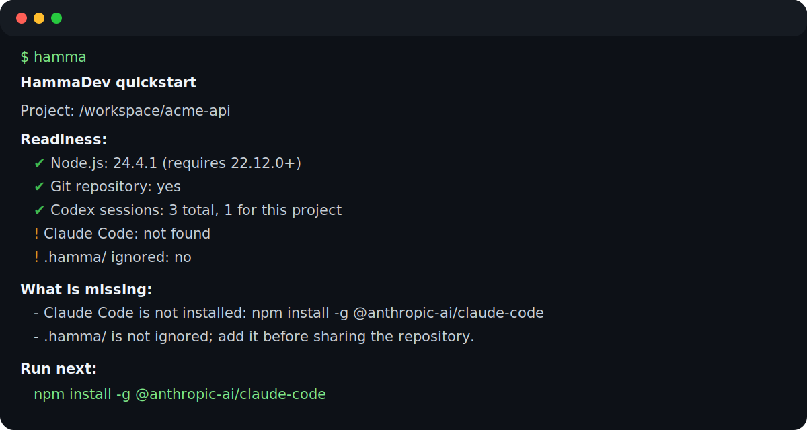

# HammaDev

**Persistent, local handoffs between AI coding agents.**

HammaDev reads a Codex CLI or Claude Code session and produces a compact,
structured handoff package another supported agent can continue from. There is
no shared cloud service, and source-agent session files are never modified.

> **Status:** v0.1 alpha · local-only CLI · Codex ↔ Claude



## What problem does this solve?

Each coding agent stores conversation history in its own format. After switching
agents, the new agent usually cannot tell what was completed, what failed, which
files changed, or what should happen next.

HammaDev extracts the goal, task ledger, verification signals, repository state,
known risks, and next action into a size-guarded `handoff.md`, with structured
supporting artifacts under the source project's local `.hamma/` directory.

### Why not just paste context?

Pasting a transcript transfers volume, not state. It can expose secrets, include
stale tool output, omit the current Git state, and encourage the next agent to
repeat completed work. HammaDev instead creates a consistent execution contract:
inspect the repository first, continue from one explicit action, preserve
unrelated changes, and verify before claiming completion.

It is still a convenience layer—not a security boundary or a substitute for
reviewing sensitive context.

## Install and validate the alpha

Requires Node.js 22.12 or newer.

```bash
npm install -g hammadev@alpha

# Confirm the alpha binary and runtime are usable.
hamma --version
hamma doctor

# Run guided onboarding from the project you want to hand off.
cd /path/to/project
hamma
```

`hamma` with no subcommand is the main first-run experience. It reports whether
Codex and Claude are installed, whether sessions exist for the current project,
whether the directory is a Git repository, and whether `.hamma/` is ignored. It
then prints the exact next command.

If a shell still resolves an older global install, check `command -v hamma` and
`npm list -g hammadev`, then reinstall with the `@alpha` tag.

## Demo flow

```bash
# 1. Diagnose this project and get the next command.
hamma

# 2. Optionally install the packaged agent skills, then restart the agents.
hamma skill install

# 3. Create a project-scoped handoff.
hamma handoff codex:project --to claude --project "$PWD"

# Or hand work in the other direction.
hamma handoff claude:project --to codex --project "$PWD"
```


## What gets generated?

```text
<project>/.hamma/tasks/<timestamp>-<source>-to-<target>/
├── handoff.md            # agent execution contract and compact brief
├── state.json            # versioned structured task state
├── session.json          # full normalized session archive
├── timeline.md           # importance-filtered chronology
├── commands.md           # shell/tool command summary
└── redaction-report.md   # redaction counts and warnings
```

The handoff starts with a strict target-agent contract, followed by **Continue
from here**, current state, completed and remaining work, verification, Git
state, risks, source metadata, safety notes, and artifact references.

See the fully synthetic examples:

- [Fake Codex and Claude sessions](examples/sessions/)
- [Generated Codex → Claude handoff package](examples/generated/codex-to-claude/)
- [Example-data notes](examples/README.md)

No example contains a real user session or credential.

## Current alpha capabilities

- Discovers Codex rollouts under `~/.codex/sessions/**/rollout-*.jsonl`.
- Discovers Claude sessions under supported Claude home directories.
- Selects project-scoped current, previous, or best resumable sessions.
- Parses both formats into a normalized `HammaSession` model.
- Excludes Claude system, thinking, tool-use, and tool-result records.
- Applies best-effort secret redaction to emitted message content.
- Captures `git status --short` and `git diff --stat` without changing Git state.
- Writes handoffs atomically and can append `.hamma/` to `.gitignore`.
- Reports project status and local handoff history without printing transcripts.
- Emits optional buffered JSONL diagnostics with trace IDs via
  `--log-level` or `HAMMA_LOG_LEVEL`.

## Commands

| Command | Purpose |
| --- | --- |
| `hamma` | Main first-run command. Diagnose this project and print exact next steps. |
| `hamma quickstart` | Explicit alias for the same guided onboarding. |
| `hamma doctor` | Validate Node 22.12+, Git, session discovery, project-path detection, and ignore safety. |
| `hamma status [--project <path>]` | Show Git state, handoff history, global/project session counts, and `.hamma/` coverage. |
| `hamma list codex` | List discovered Codex sessions, newest first. |
| `hamma list claude [--project <path>] [--json]` | List or rank Claude sessions without modifying them. |
| `hamma inspect <target> [--summary]` | Print a normalized session. Targets include agent IDs and validated native JSONL paths. |
| `hamma inspect claude:last --shape` | Print structural Claude JSONL statistics without message content. |
| `hamma handoff codex:<target> --to claude` | Generate a Codex → Claude package. |
| `hamma handoff claude:<target> --to codex` | Generate a Claude → Codex package. |
| `hamma log [--project <path>]` | List local handoffs newest first. |
| `hamma show latest` | Print the newest local `handoff.md`. |
| `hamma skill install [--force]` | Install the packaged handoff, snapshot, and resume skills. |

Use `hamma <command> --help` for complete options. Structured logs are disabled
by default and are written to stderr, preserving JSON stdout.

## Security limitations

Read this before using HammaDev with sensitive repositories:

- **Redaction is best effort, not a guarantee.** Regexes can miss passwords,
  proprietary data, unusual tokens, source code, and secrets split across text.
- **`session.json` is intentionally a fuller archive.** It may contain sensitive
  user messages, command text, and tool output after normalization. Keep the
  entire `.hamma/` directory local and inspect every artifact before sharing.
- **Session text is untrusted input.** A malicious or accidental prompt in a
  source session can survive as task context. The handoff labels source-derived
  text untrusted, but the receiving agent and human operator must enforce that
  boundary.
- **`.gitignore` is not access control.** It reduces accidental commits but does
  not stop `git add -f`, filesystem backups, indexing tools, or other users on
  the machine from reading artifacts.
- **Local-only does not mean risk-free.** HammaDev reads agent histories and
  writes into the detected project. Review the selected session and project path.
- **Parser output can be incomplete or wrong.** Conservative filtering may omit
  relevant context, and heuristic task extraction may misclassify status. Always
  reconcile the handoff with the current repository.
- **Path and size guards reduce exposure, not all attacks.** Inputs are limited
  to configured agent roots, symlink escapes and `..` are rejected, and session
  files over 50 MiB fail early; these controls do not make hostile session
  content safe.

HammaDev currently makes no network calls and has no telemetry or backend. See
[troubleshooting](docs/troubleshooting.md) for generic error categories and
local diagnostic logging.

## Agent skills

`skills/hamma-handoff/`, `skills/hamma-snap/`, and `skills/hamma-resume/` provide
agent-host workflows for cross-agent handoff and compact session continuation.
Install them with:

```bash
hamma skill install
```

Restart Codex and Claude Code after installation so they discover the skills.

## Development

Requirements: Node.js 22.12+ and [pnpm](https://pnpm.io/) 10+.

```bash
git clone https://github.com/<you>/hammadev.git
cd hammadev
pnpm install
pnpm typecheck
pnpm test
pnpm build
```

CI runs typecheck, build, unit tests, website checks, and browser tests on both
Node 22.12 and Node 24.

## Current alpha limitations

- Only Codex CLI and Claude Code handoffs are supported.
- Claude parsing is intentionally conservative and may omit useful tool context.
- Handoffs remain local to one machine; there is no sync or team backend.
- Task extraction and redaction are heuristic and require human review.

## Roadmap

- Additional source adapters: Gemini CLI, opencode, and Antigravity.
- Richer task-ledger extraction and verification evidence.
- More history filters and handoff retention controls.
- Optional cross-machine and team workflows after the local format stabilizes.

## License

ISC. See `package.json`.
